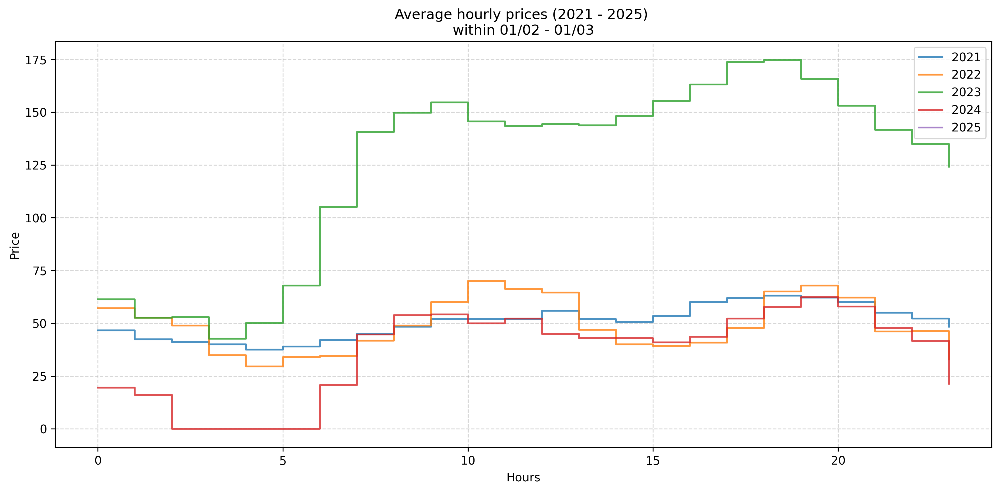
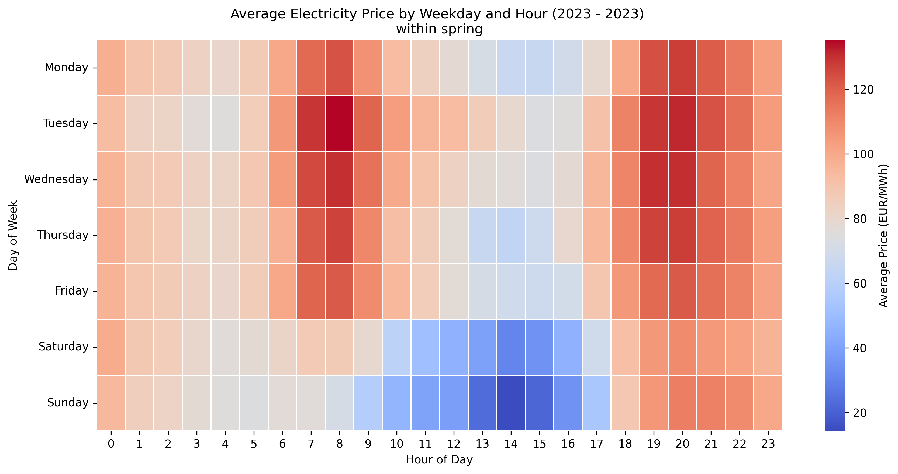
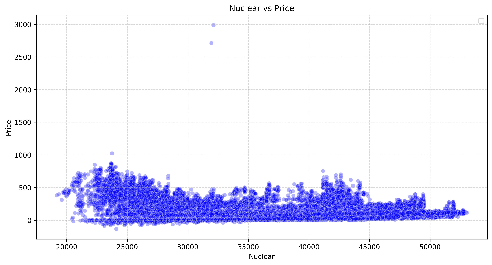
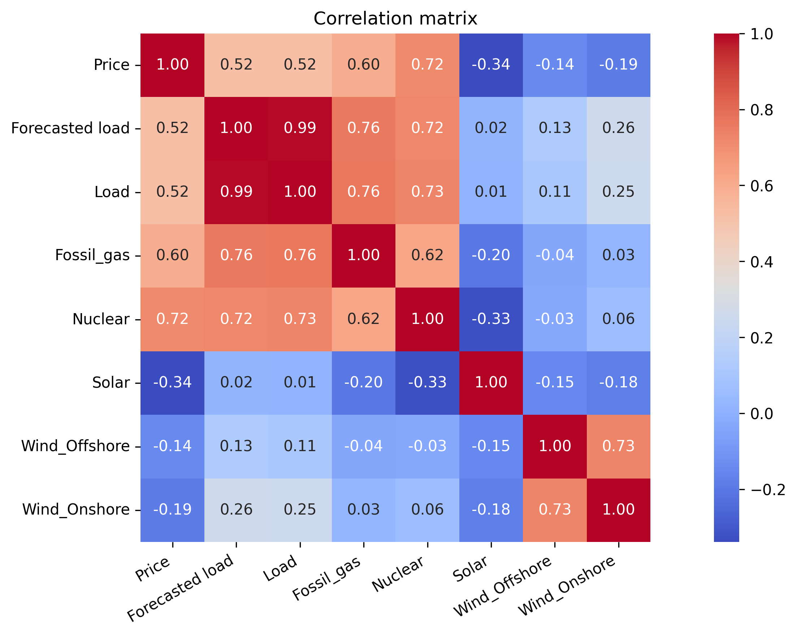
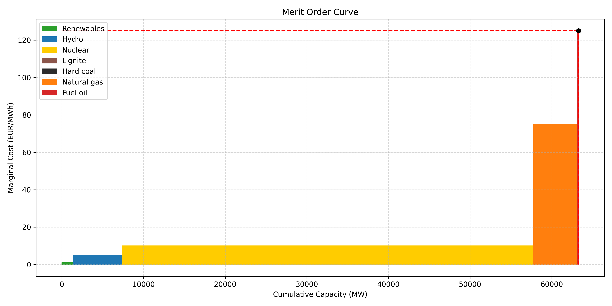
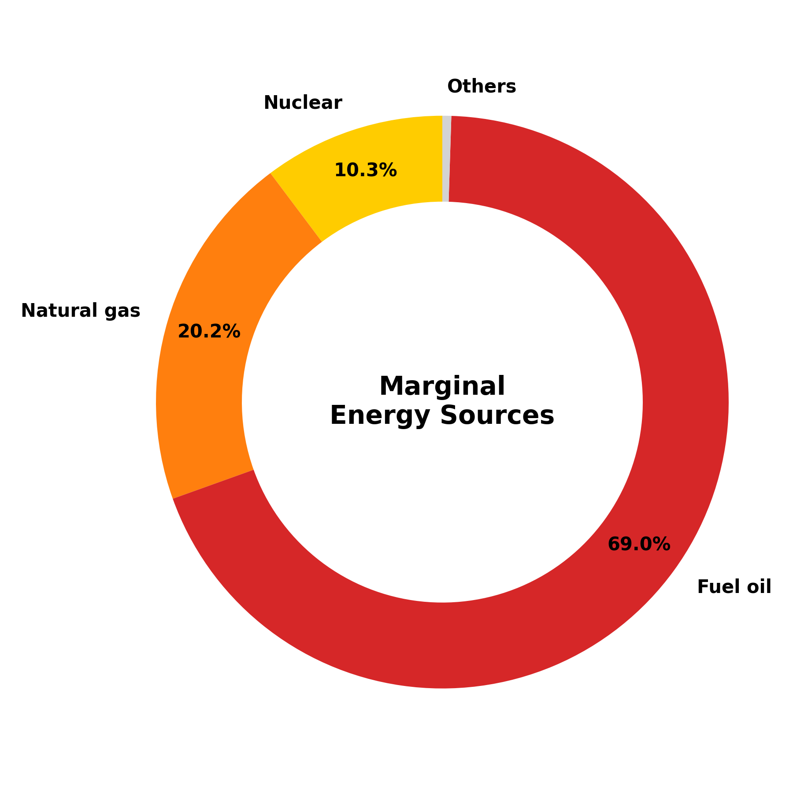

# Day-Ahead Electricity Market Analysis (EPEX Spot)

This repository contains a structured analysis of the French day-ahead electricity market (EPEX Spot).
The project explores historical data, identifies key price drivers, and builds the foundation for forecasting models.
The project is divided into four main parts:

1. **Data Cleaning & Preprocessing**  
2. **Exploratory Visualization**  
3. **Market Analysis**  
4. **Market Forecast (in development)** 

## 📊 Project Overview

Electricity markets are fundamental to balancing **supply and demand in real-time**.  
This project explores **day-ahead price dynamics in France**, analyzing key drivers such as demand, renewables, nuclear availability, and external conditions.

The objectives are:
- Collect and clean raw data (prices, demand, generation, weather)
- Build intuitive visualizations to highlight patterns 
- Identify drivers of price fluctuations
- Provide a first forecasting baseline (to be extended)

## Data Sources

The dataset combines:
- **EPEX Spot day-ahead prices** (hourly resolution)
- **ENTSO-E / RTE data** on demand and generation (nuclear, renewables, fossil)

## Technologies

- Python (pandas, matplotlib, scipy)
- Jupyter Notebook

## Module

- Install all the required packages by running: pip install -r requirements.txt

## Part 1 - Data Cleaning and Processing

## Part 2 - Exploratory Visualization

This part focus on **visualization patterns** in the spot market

### Time Series Plots

- Price evolution across a period
- Smoothed Daily Average Price:
- Daily Candlestick Chart of Day-Ahead Prices:

### Average Daily Price Profile

### Hourly Price Heatmap

## Part 3 - Market Analysis

### Price-Capacity Scatter Plots

### Correlation Matrix Of Price Drivers

  
  

### Marginal Technology Mix

  
  

## Part 4 - Market Forecast (work in progress)

Next steps:
- Baseline forecasting models:  
  - Linear Regression  
  - Decision Trees / Random Forests  
  - ARIMA  
- Evaluate with **MAPE / RMSE**
- Compare forecast vs ENTSOE's forecast vs actual prices

