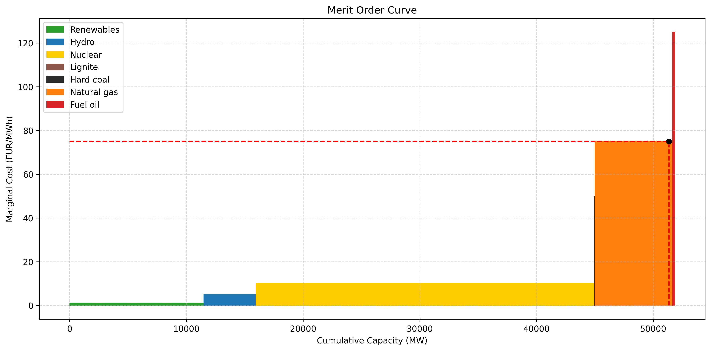

# Day-Ahead Electricity Market Analysis (EPEX Spot)

This repository contains a structured analysis of the French day-ahead electricity market (EPEX Spot).
The project explores historical data, identifies key price drivers, and builds the foundation for forecasting models.
The project is divided into four main parts:

1. **Data Cleaning & Preprocessing**  
2. **Exploratory Visualization**  
3. **Market Analysis**  
4. **Market Forecast (in development)** 

## 📊 Project Overview

Electricity markets are fundamental to balancing **supply and demand in real-time**.  
This project explores **day-ahead price dynamics in France**, analyzing key drivers such as demand, renewables, nuclear availability, and external conditions.

The objectives are:
- Collect and clean raw data (prices, demand, generation, weather)
- Build intuitive visualizations to highlight patterns 
- Identify drivers of price fluctuations
- Provide a first forecasting baseline (to be extended)

## Data Sources

The dataset combines:
- **EPEX Spot day-ahead prices** (hourly resolution)
- **ENTSO-E / RTE data** on demand and generation (nuclear, renewables, fossil)

## Technologies

- Python (pandas, matplotlib, scipy)
- Jupyter Notebook

## Module

- Install all the required packages by running: pip install -r requirements.txt

## Part 1 - Data Cleaning and Processing

Electricity market datasets are large, heterogeneous, and often incomplete, so preprocessing is a crucial step before any visualization or modeling. The goal is to build a single, consistent, hourly master dataset that combines day-ahead prices with demand and generation fundamentals.

In this step:
- Loaded raw CSVs (prices, load, generation)
- Timestamp standardization
- Merging datasets
- Handled missing values

Outcome:
Clean, enriched dataset ready for use

## Part 2 - Exploratory Visualization

Exploratory data analysis is essential to detect patterns, seasonality, and anomalies in the French day-ahead electricity market. Visualizations provide intuition on how demand, generation mix, and external factors shape price dynamics.

### Time Series Plots

We begin with a full-year time series of French day-ahead electricity prices (hourly resolution). This visualization highlights overall price volatility, and notable spikes often linked to demand peaks or supply constraints.

### Average Daily Price Profile

Next, we examine the **average daily price curve**, computed by aggregating all days of the selected period for multiple years.  
This chart reveals typical **day-ahead price dynamics**:  
- Morning ramp-up as demand increases
- Midday moderation with solar generation
- Evening peak due to high residential and commercial demand
- Changes between the years

### Hourly Price Heatmap

Finally, we combine seasonality and price dynamics with a **heatmap**.  
- The x-axis shows the **hour of the day (0–23h)**
- The y-axis shows the **weekday**
- Colors represent price levels

This representation allows us to detect both **recurring hourly peaks** and **seasonal effects** (e.g. higher winter evening prices, lower summer midday prices).  

## Part 3 - Market Analysis

This section identifies and quantifies the main drivers behind French day-ahead electricity prices. We examine correlations between prices and fundamental factors such as demand, renewable generation, and nuclear availability. Statistical modeling (OLS regression) helps measure their relative influence.

### Price-Capacity Scatter Plots

Scatter plots compare day-ahead prices vs generation by technology (e.g., solar, wind) to visualize how varying supply levels influence market prices

### Correlation Matrix Of Price Drivers

Scatter plots might be a good first insight into the relation price vs generation by technology, but they just reveal trends. For more accuracy, a correlation matrix highlights dependencies between prices and key market drivers (e.g., load, solar, nuclear, ...)

Key observations:
- Load shows strong positive correlation with prices
- Renewable generation (e.g., wind, solar) is negatively correlated with prices. Price tends to decrease as renewable generation goes up

### Marginal Technology Mix

General idea:

The day-ahead electricity price is determined by supply and demand. For each hour, the marginal plant needed to satisfy the demand, determined the price. Thus, the price is the marginal cost associated to that last plant.
Therefore, to see this functionnement, we plot a chart with the marginal cost of each plant by the cumulative capacity, with plant sorted by marginal cost, called the merit order curve. Thus, as mention previously, for each hour we can estimate the electricity price by matching supply and demand.

In this case:

A few hypothesis have been made (because of missing data):
- Marginal costs are said to be constant in time
- All marginal costs from the same sources (e.g., nuclear plant, solar plant, ...) are said to be constant
- Importation of electricity is not considered
- If load exceed supply we assume the last plant set the price

  
  

### Merit Order Effect (MOE)

The main price drivers are now known but not their quantitative influence on the price. Thus, an OLS regression can quantify how each generation source impacts the price.

First chart, specific MOE:
-We want to know the price impact of adding more renewables to the existing installions. Thus we model the electricity price following this formulas

Second chart, technologies MOE:
Now let's try another approach and see the influence of the current generation mix on the electricity price. Compared to equation 1, we included all the generation technologies as show by equation 2:

The OLS regression gives a coefficient for each generation technology, which represent the effect of a marginal demand of 1GWh that is met by the technology.

  
  

## Part 4 - Market Forecast (work in progress)

Next steps:
- Baseline forecasting models:  
  - Linear Regression  
  - Decision Trees / Random Forests  
  - ARIMA  
- Evaluate with **MAPE / RMSE**
- Compare forecast vs ENTSOE's forecast vs actual prices

