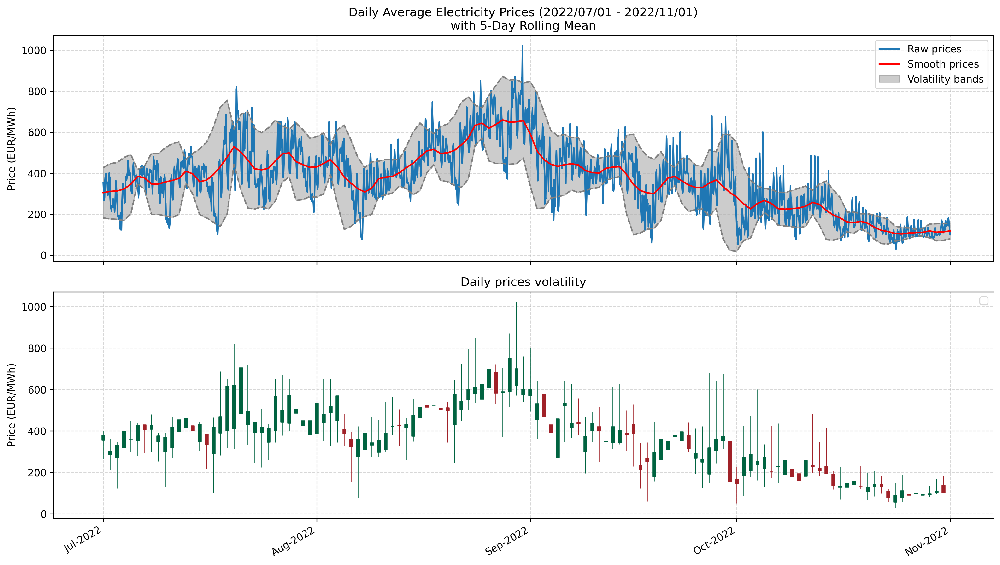
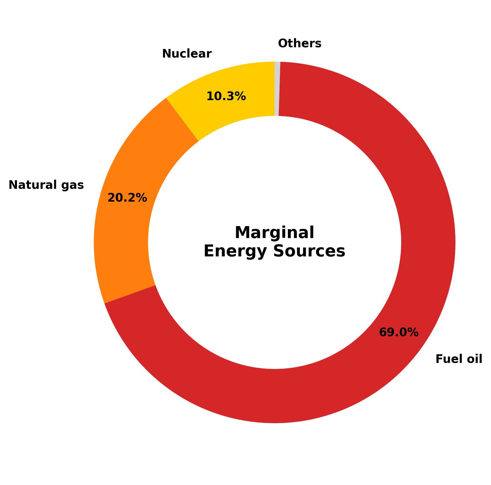
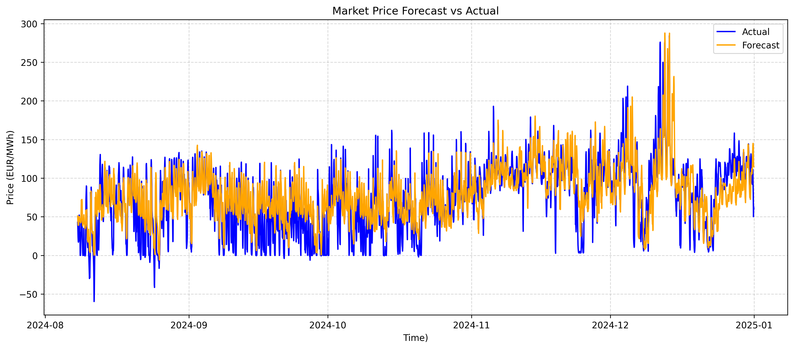
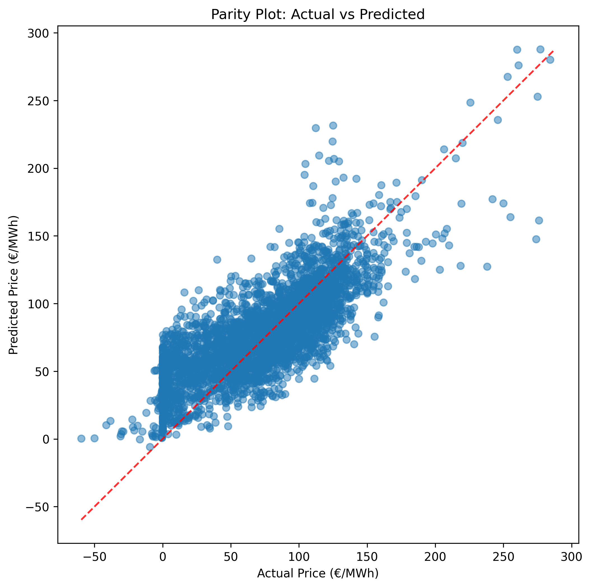

# Day-Ahead Electricity Market Analysis (EPEX Spot)

This repository contains a structured analysis of the French day-ahead electricity market (EPEX Spot).
The project explores historical data, identifies key price drivers, and builds the foundation for forecasting models.
The project is divided into four main parts:

1. **Data Cleaning & Preprocessing**  
2. **Exploratory Visualization**  
3. **Market Analysis**  
4. **Market Forecast (in development)** 

## 📊 Project Overview

Electricity markets are fundamental to balancing **supply and demand in real-time**.  
This project explores **day-ahead price dynamics in France**, analyzing key drivers such as demand, renewables, nuclear availability, and external conditions.

The objectives are:
- Collect and clean raw data (prices, demand, generation, weather)
- Build intuitive visualizations to highlight patterns 
- Identify drivers of price fluctuations
- Provide a first forecasting baseline (to be extended)

## Data Sources

The dataset combines:
- **EPEX Spot day-ahead prices** (hourly resolution)
- **ENTSO-E / RTE data** on demand and generation (nuclear, renewables, fossil)

## Technologies

- Python (pandas, matplotlib, scipy)
- Jupyter Notebook

## Module

- Install all the required packages by running: pip install -r requirements.txt

## Part 1 - Data Cleaning and Processing

Electricity market datasets are large, heterogeneous, and often incomplete, so preprocessing is a crucial step before any visualization or modeling. The goal is to build a single, consistent, hourly master dataset that combines day-ahead prices with demand and generation fundamentals.

In this step:
- Loaded raw CSVs (prices, load, generation)
- Timestamp standardization
- Merging datasets
- Handled missing values

Outcome:
Clean, enriched dataset ready for use

## Part 2 - Exploratory Visualization

Exploratory data analysis is essential to detect patterns, seasonality, and anomalies in the French day-ahead electricity market. Visualizations provide intuition on how demand, generation mix, and external factors shape price dynamics.

### Time Series Plots

We begin with a full-year time series of French day-ahead electricity prices (hourly resolution). This visualization highlights overall price volatility, and notable spikes often linked to demand peaks or supply constraints.

### Average Daily Price Profile

Next, we examine the **average daily price curve**, computed by aggregating all days of the selected period for multiple years.  
This chart reveals typical **day-ahead price dynamics**:  
- Morning ramp-up as demand increases
- Midday moderation with solar generation
- Evening peak due to high residential and commercial demand
- Changes between the years

### Hourly Price Heatmap

Finally, we combine seasonality and price dynamics with a **heatmap**.  
- The x-axis shows the **hour of the day (0–23h)**
- The y-axis shows the **weekday**
- Colors represent price levels

This representation allows us to detect both **recurring hourly peaks** and **seasonal effects** (e.g. higher winter evening prices, lower summer midday prices).  

## Part 3 - Market Analysis

This section identifies and quantifies the main drivers behind French day-ahead electricity prices. We examine correlations between prices and fundamental factors such as demand, renewable generation, and nuclear availability. Statistical modeling (OLS regression) helps measure their relative influence.

### Price-Capacity Scatter Plots

Scatter plots compare day-ahead prices vs generation by technology (e.g., solar, wind) to visualize how varying supply levels influence market prices

### Correlation Matrix Of Price Drivers

Scatter plots might be a good first insight into the relation price vs generation by technology, but they just reveal trends. For more accuracy, a correlation matrix highlights dependencies between prices and key market drivers (e.g., load, solar, nuclear, ...)

Key observations:
- Load shows strong positive correlation with prices
- Renewable generation (e.g., wind, solar) is negatively correlated with prices. Price tends to decrease as renewable generation goes up

### Marginal Technology Mix

General idea:

Producers submit bids that reflect their short-run marginal costs. These bids are ordered from lowest to highest and plotted against cumulative capacity.
For any given hour, electricity demand is placed on this curve. The point where demand meets supply indicates which plant — the marginal plant — must be activated. Its marginal cost sets the price. This explains why low-cost renewables, by shifting the curve to the right, tend to reduce wholesale prices: the so-called merit order effect.
In this project, the merit order curve is used to build a stylized representation of price formation in the French day-ahead market. For each hour, demand is matched to the cumulative supply curve, and the marginal technology is identified to approximate the market-clearing price.

Several simplifying assumptions were necessary:

A few hypothesis have been made (because of missing data):
- Marginal costs are assumed constant over time
- All plants of the same technology share the same marginal cost
- Imports and exports are not considered
- If demand exceeds supply, the last plant sets the price

This framework cannot capture all real-world dynamics (fuel price volatility, cross-border flows, unit constraints), but it provides an intuitive and transparent way to illustrate how demand, generation mix, and technology costs interact to shape electricity prices.

  
  

### Merit Order Effect (MOE)

The main price drivers of the day-ahead market are identified, but their quantitative influence on prices needs to be measured. To achieve this, we apply Ordinary Least Squares (OLS) regression, which allows us to estimate how different generation sources affect electricity prices

First chart, specific MOE:
To assess the price impact of additional renewable energy, we model the electricity price with the following equation:

  

$$
\begin{align}
  \text{Spot}_{t} = c + b_{1}\,\text{wind}_{t} + b_{2}\,\text{pv}_{t}
  + \sum_{k=1}^{23} b_{k+3}\,dh_{kt}
  + \sum_{l=1}^{6} b_{l+26}\,dd_{lt}
  + \sum_{m=1}^{11} b_{m+32}\,dm_{mt}
  + \sum_{n=1}^{3} b_{m+43}\,dy_{nt} + u_{t}
\end{align}
$$

The coefficient behind the energy variables represent the amount of EUR/MWh per GWh of newly added renewables. Thanks to an OLS regression over a period of 4 years (2021-2024), renewables energy coefficient is equal to -4.5 EUR/MWh per GWh. This indicates that each additional GWh of renewable energy reduces the day-ahead price by 4.5 EUR/MWh, consistent with the negative correlation observed in our earlier correlation analysis. This effect reflects the Merit Order Effect: as low-marginal-cost renewables enter the market, they push more expensive generation out of the supply curve, lowering prices.

  

Now let's try another approach and see the influence of the current generation mix on the electricity price. Compared to equation 1, we included all the generation technologies as show by equation 2:

The OLS regression gives a coefficient for each generation technology, which represent the effect of a marginal demand of 1GWh that is met by the technology.

  

## Part 4 - Market Forecast (work in progress)

Next steps:
- Baseline forecasting models:  
  - Linear Regression + XGBoost on the errors from the linear regression 
  - Decision Trees / Random Forests

We run an XGBoost model on the current data, from 2021 to early 2025, to forecast electricty prices.
To evaluate the performance of the XGBoost forecasting model, we compared the predicted day-ahead electricity prices with the actual observed values over the test period. The overlapping time series plot highlights how closely the model tracks real price fluctuations, including peaks and troughs. While some deviations are visible during sudden price spikes, the overall alignment demonstrates the model’s ability to capture the main dynamics and temporal patterns of the market.

RMSE: 28.22
MAE: 22.16

  

In addition, a parity plot was generated to compare forecasted values against actual prices on a point-by-point basis. Ideally, a perfect model would have all points lying along the 45-degree diagonal line. In practice, the results show a tight clustering around this line, confirming that the model predictions are reasonably accurate. The dispersion of points around extreme values indicates areas where the model is less precise, but overall the parity plot reinforces the robustness of the forecasting approach.

  

